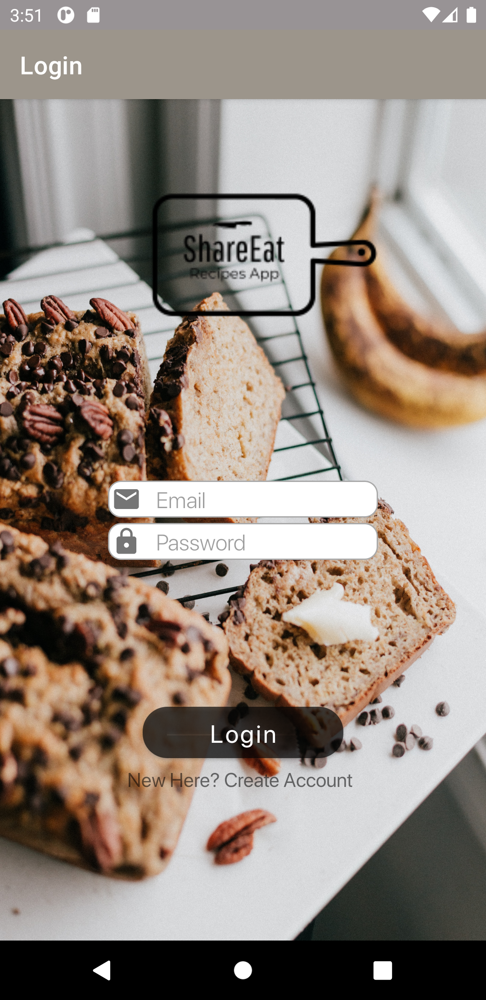
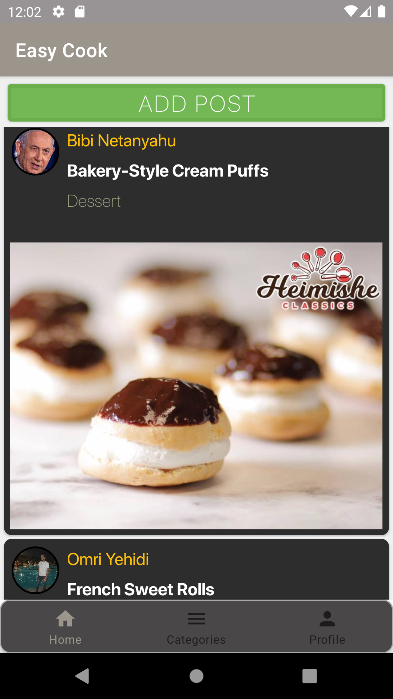

# Share_Eat
An android application-Cook book which any user can share his recipe with others users and get inspired by others recipes.

:cake: :pizza:	:pancakes:	:meat_on_bone:	:shallow_pan_of_food:	:green_salad:

## Instructions

1.**Authentication** - _Login & Register Pages_  
2.**AllPosts** - Shows all user's recipes by last created  
3.**AddPost** - Add a new recipe to the list  
4.**Profile** - _Shows only the recipes of the logged in user_  
6.**Search** - _Choose recipes by categories_  

## Preview
   

## Developed By:
* _Omri Yehidi_ - [LinkedIn](https://www.linkedin.com/in/omriyehidi/)
* _Igal Rachman_ - [LinkedIn](https://www.linkedin.com/in/igal-rachman-a67956199/)
